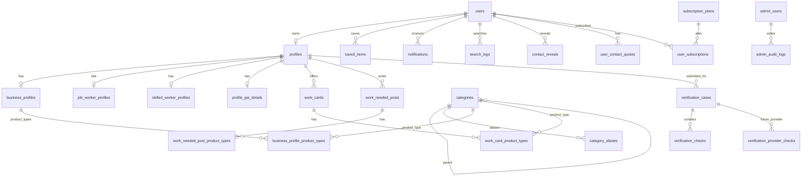

# Textile Marketplace MVP Database Design

Date: 2026-07-08

Status: Draft v1 after database discovery rounds 1-10.

Primary database: PostgreSQL, managed through Supabase or another managed PostgreSQL provider.

Important access rule: the mobile app and admin dashboard should not directly write marketplace tables. Important writes go through backend APIs or Edge Functions. PostgreSQL RLS still exists as a second safety layer.

## 1. Design Goals

- Support three locked profile roles:
  - manufacturer / business
  - job worker / value adder / workshop
  - skilled worker / karigar
- Keep one user tied to one active profile.
- Keep role-specific profile data separate without duplicating the common profile model.
- Make work cards and work-needed posts first-class searchable objects.
- Keep search fast in PostgreSQL first, using category, aliases, full-text search, locality filters, and cached ranking fields.
- Store media once, with public media separated from private verification documents.
- Support manual admin verification first, with future provider checks.
- Store analytics from day one: search logs, profile views, contact actions, shares, contact reveals.
- Prepare future subscription/contact-reveal locking without enabling payments in MVP.
- Avoid storing raw Aadhaar/PAN/identity numbers.

## 2. Global Conventions

All main tables use:

- `id uuid primary key default gen_random_uuid()`
- `created_at timestamptz not null default now()`
- `updated_at timestamptz not null default now()`
- `deleted_at timestamptz null` where soft delete is needed

Naming:

- plural snake_case table names
- snake_case column names
- status fields are `text` with CHECK constraints, not PostgreSQL enum types, to keep the database flexible

Recommended PostgreSQL extensions:

```sql
create extension if not exists pgcrypto;
create extension if not exists pg_trgm;
```

Optional later:

```sql
create extension if not exists unaccent;
```

## 3. High-Level ERD



Polymorphic tables not fully shown in the ERD:

- `media_assets` links to `profile`, `work_card`, `work_needed_post`, or `verification_case`.
- `saved_items` links to `profile`, `work_card`, or `work_needed_post`.
- `reports` links to reportable public entities.
- `contact_reveals.source_type` optionally links to the source work card/post that led to the profile reveal.

## 4. Core Identity And Profile Tables

### 4.1 `users`

Purpose: app-level user record mapped to mobile OTP auth.

Columns:

| Column | Type | Notes |
|---|---|---|
| `id` | uuid pk | App user id |
| `auth_user_id` | uuid unique null | Supabase Auth user id, if using Supabase Auth |
| `display_name` | text not null | Name entered before OTP |
| `primary_mobile` | text not null | OTP mobile number |
| `account_status` | text not null | `active`, `suspended`, `terminated` |
| `role` | text null | `business`, `job_worker`, `skilled_worker` |
| `role_confirmed_at` | timestamptz null | Set after role confirmation |
| `profile_completed_at` | timestamptz null | Used for role immutability |
| `last_login_at` | timestamptz null | Login analytics |
| `created_at` | timestamptz |  |
| `updated_at` | timestamptz |  |
| `deleted_at` | timestamptz null | Soft delete marker |

Constraints:

- `account_status in ('active', 'suspended', 'terminated')`
- `role in ('business', 'job_worker', 'skilled_worker')` when not null
- Active mobile uniqueness:

```sql
create unique index uq_users_active_mobile
on users (primary_mobile)
where account_status <> 'terminated' and deleted_at is null;
```

Note: if Supabase Auth enforces unique phone numbers, termination must also release or recreate the auth identity so the same mobile number can be reused.

### 4.2 `profiles`

Purpose: common public and operational profile record for all roles.

Columns:

| Column | Type | Notes |
|---|---|---|
| `id` | uuid pk |  |
| `owner_user_id` | uuid null fk users(id) | Null for admin-created seed profiles |
| `role` | text not null | Same role as user when owned |
| `public_name` | text null | Cached display name, such as business/workshop/person name |
| `owner_name` | text null | Owner/person name; locked after completion |
| `alternate_contact_number` | text null | Optional secondary contact |
| `full_address` | text null | Free-text full address |
| `address_line1` | text null | Structured address |
| `address_line2` | text null | Structured address |
| `locality` | text null | User-facing locality |
| `normalized_locality` | text null | Search/filter value |
| `city` | text null | Required for location filtering |
| `state` | text null |  |
| `pincode` | text null |  |
| `state_id` | smallint null fk location_states(id) | Canonical state/UT selected from backend options |
| `district_id` | integer null fk location_districts(id) | Canonical city/postal district selected within state |
| `location_validation_status` | text not null default 'unvalidated' | `unvalidated`, `valid`, `warning`, `invalid` |
| `location_validated_at` | timestamptz null | Last successful backend postal check |
| `visibility_status` | text not null | `draft`, `public`, `hidden_by_user`, `suspended_by_admin`, `deleted` |
| `verification_status` | text not null | `unverified`, `pending`, `verified`, `changes_requested`, `rejected` |
| `completion_score` | integer not null default 0 | 0-100 |
| `completion_flags` | jsonb not null default '{}' | Missing/complete field flags |
| `photo_count` | integer not null default 0 | Public profile/shop/workplace photo count cache |
| `is_verified` | boolean not null default false | Cached from verification status |
| `reverification_required` | boolean not null default false | Sensitive verified-field edits require a new review |
| `ranking_score` | numeric(10,4) not null default 0 | Cached ranking score |
| `last_activity_at` | timestamptz null | Ranking and stale-reminder support |
| `search_text` | text null | Backend-generated search text |
| `search_vector` | tsvector null | PostgreSQL full-text search |
| `is_admin_seeded` | boolean not null default false | True for admin-entered demo data |
| `created_by_admin_user_id` | uuid null fk admin_users(id) | Seed profile creator |
| `claim_status` | text null | `unclaimed`, `claimed`, `not_claimable` |
| `created_at` | timestamptz |  |
| `updated_at` | timestamptz |  |
| `deleted_at` | timestamptz null |  |

Constraints:

- `role in ('business', 'job_worker', 'skilled_worker')`
- `visibility_status in ('draft', 'public', 'hidden_by_user', 'suspended_by_admin', 'deleted')`
- `verification_status in ('unverified', 'pending', 'verified', 'changes_requested', 'rejected')`
- `completion_score between 0 and 100`
- One active profile per user:

```sql
create unique index uq_profiles_owner_active
on profiles (owner_user_id)
where owner_user_id is not null and deleted_at is null;
```

Backend rules:

- Profile appears in search only when minimum role-specific required fields are complete and `visibility_status = 'public'`.
- Role cannot change after profile completion.
- Admin-created profiles can exist with `owner_user_id is null`.
- No `profile_claim_requests` table in MVP.
- Complete profiles require a backend-accepted `valid` or `warning` postal check. State/PIN or district/PIN mismatches are invalid; uncertain area-name matches are warnings.

### 4.3 India Location Reference Tables

The backend imports and normalizes the Department of Posts public PIN directory. The raw CSV is not stored.

- `location_states`: canonical state and Union Territory names.
- `location_districts`: state-scoped city/postal-district options.
- `postal_codes`: one canonical state/district mapping per six-digit PIN.
- `postal_areas`: deduplicated post-office/area names per PIN.

All four tables have RLS enabled and explicit `anon`/`authenticated` grants revoked. Flutter and admin access them only through FastAPI.

## 5. Role-Specific Profile Tables

### 5.1 `business_profiles`

Purpose: manufacturer, wholesaler, trader, retailer, brand, process house, or similar business details.

Columns:

| Column | Type | Notes |
|---|---|---|
| `profile_id` | uuid pk fk profiles(id) |  |
| `business_name` | text not null | Mandatory |
| `business_category_id` | uuid null fk categories(id) | Category type `business_category` |
| `custom_business_category` | text null | User-entered label when the mapped category is `Other`; creates a pending category suggestion |
| `manufacture_sell_details` | text not null | What they manufacture/sell |
| `product_notes` | text null | Optional free text |
| `created_at` | timestamptz |  |
| `updated_at` | timestamptz |  |

Required for minimum complete profile:

- mobile number on `users`
- business name
- owner name on `profiles`
- business category
- manufacture/sell details
- at least one product type in `business_profile_product_types`
- address/locality/city
- at least 3 shop/business photos

### 5.2 `business_profile_product_types`

Purpose: structured product types for manufacturer/business profiles, because the wireframe collects product type during profile completion and search needs product filters.

Columns:

| Column | Type | Notes |
|---|---|---|
| `id` | uuid pk | Row identity is required because custom product text is allowed |
| `profile_id` | uuid fk profiles(id) | Must belong to a business profile |
| `product_type_category_id` | uuid null fk categories(id) | Category type `product_type` |
| `custom_product_type_text` | text null | User-entered product type before admin mapping |
| `created_at` | timestamptz |  |

Rules:

- At least one of `product_type_category_id` or `custom_product_type_text` is required.
- Mapped product types should be unique per profile.
- Custom product type text should be normalized by backend for search and duplicate checks.
- Custom text should also create a `category_suggestions` row for admin mapping.

### 5.3 `business_subtypes`

Purpose: structured manufacturer/wholesaler/trader/retailer/other classification.

Columns:

| Column | Type | Notes |
|---|---|---|
| `id` | uuid pk |  |
| `code` | text unique not null | `manufacturer`, `wholesaler`, `trader`, `retailer`, `other` |
| `label` | text not null | Display label |
| `is_active` | boolean not null default true |  |
| `sort_order` | integer not null default 0 |  |
| `created_at` | timestamptz |  |
| `updated_at` | timestamptz |  |

### 5.4 `profile_business_subtypes`

Purpose: many-to-many mapping because a business can be manufacturer and wholesaler.

Columns:

| Column | Type | Notes |
|---|---|---|
| `profile_id` | uuid fk profiles(id) |  |
| `business_subtype_id` | uuid fk business_subtypes(id) |  |
| `free_text` | text null | Optional "what they do" text |
| `created_at` | timestamptz |  |

Primary key:

- `(profile_id, business_subtype_id)`

### 5.5 `job_worker_profiles`

Purpose: workshop/value-adder/job-worker profile details.

Columns:

| Column | Type | Notes |
|---|---|---|
| `profile_id` | uuid pk fk profiles(id) |  |
| `workshop_name` | text null | Mandatory if workshop |
| `has_workshop` | boolean not null default true | Helps support home-based workers later |
| `work_summary` | text null | What kind of work they do |
| `profile_experience_years` | integer null | Overall experience |
| `created_at` | timestamptz |  |
| `updated_at` | timestamptz |  |

Required for minimum complete profile:

- mobile number on `users`
- owner name on `profiles`
- workshop/business name if workshop
- address/locality/city
- at least one published work card
- at least 3 workplace/shop photos for blue tick

Important:

- Job-worker category/product details used in search should live on `work_cards`, not duplicated as mandatory normalized columns on `job_worker_profiles`.
- The profile-completion flow must either prompt the user to add the first work card or clearly state that the profile will not appear in job-worker work search until a work card is published.

### 5.6 `skilled_worker_profiles`

Purpose: individual karigar profile details.

Columns:

| Column | Type | Notes |
|---|---|---|
| `profile_id` | uuid pk fk profiles(id) |  |
| `primary_skill_category_id` | uuid null fk categories(id) | Transitional first mapped skill for backward-compatible cards; new writes use `skilled_worker_profile_skills` |
| `skill_mastery` | text not null | Mandatory |
| `experience_years` | integer null | Mandatory before completion; null distinguishes unanswered from zero years |
| `bio` | text null | Optional |
| `created_at` | timestamptz |  |
| `updated_at` | timestamptz |  |

Required for minimum complete profile:

- mobile number on `users`
- name/public name
- at least one mapped or custom skill
- skill mastery/detail
- experience
- area/address

Worker photo and work photos are recommended, not mandatory for search visibility.

### 5.7 `skilled_worker_profile_skills`

Purpose: normalized, ordered multi-skill selection for one karigar profile.

Columns:

| Column | Type | Notes |
|---|---|---|
| `id` | uuid pk | Generated with `gen_random_uuid()` |
| `profile_id` | uuid fk skilled_worker_profiles(profile_id) | Required |
| `skill_category_id` | uuid null fk categories(id) | Mapped skill selected from taxonomy |
| `custom_skill_text` | text null | Other skill entered by the user |
| `sort_order` | smallint not null | Preserves selection/display order |
| `created_at` | timestamptz | |

Constraints and behavior:

- exactly one of `skill_category_id` and `custom_skill_text` is populated
- the same mapped skill cannot be selected twice for one profile
- custom values are also added to `category_suggestions` with type `skill`
- changing skills replaces this small owned collection in one backend transaction
- all selected skills feed profile `search_text` and `search_vector`
- the table has RLS enabled and direct `public`, `anon`, and `authenticated`
  privileges revoked; Flutter accesses it only through FastAPI
- existing `primary_skill_category_id` values are backfilled into this table

## 6. GST And Sensitive Verification Data

### 6.1 `profile_gst_details`

Purpose: structured GST data for business and job-worker profiles when applicable.

Columns:

| Column | Type | Notes |
|---|---|---|
| `id` | uuid pk |  |
| `profile_id` | uuid unique fk profiles(id) |  |
| `gstin` | text not null | Optional feature, but structured when present |
| `gst_legal_name` | text null | Manual or future provider result |
| `gst_trade_name` | text null | Manual or future provider result |
| `gst_status` | text null | Example: active/cancelled if known |
| `review_status` | text not null default 'unreviewed' | `unreviewed`, `pending`, `approved`, `rejected` |
| `proof_media_asset_id` | uuid null | Optional media reference |
| `reviewed_by_admin_user_id` | uuid null fk admin_users(id) |  |
| `gst_reviewed_at` | timestamptz null |  |
| `created_at` | timestamptz |  |
| `updated_at` | timestamptz |  |

No PAN table and no PAN column for MVP.

### 6.2 Identity Proof Rule

There are no raw identity proof number columns in this schema.

Identity proof is represented by:

- a private `media_assets` row
- a `verification_checks` row with `check_type = 'identity_proof'`
- review status and notes

Do not store Aadhaar number. If a user uploads Aadhaar-like proof, require masked/alternate ID handling at the product/backend layer.

## 7. Taxonomy And Category Tables

### 7.1 `categories`

Purpose: flexible taxonomy for work categories, work names, product types, skills, and business categories.

Columns:

| Column | Type | Notes |
|---|---|---|
| `id` | uuid pk |  |
| `parent_id` | uuid null fk categories(id) | Parent-child hierarchy |
| `category_type` | text not null | `business_category`, `work_category`, `work_name`, `product_type`, `skill` |
| `name` | text not null | Display name |
| `slug` | text not null | Stable code |
| `normalized_name` | text not null | Search matching |
| `description` | text null | Admin explanation |
| `is_active` | boolean not null default true |  |
| `sort_order` | integer not null default 0 |  |
| `created_by_admin_user_id` | uuid null fk admin_users(id) |  |
| `metadata` | jsonb not null default '{}' | Future extra taxonomy data |
| `created_at` | timestamptz |  |
| `updated_at` | timestamptz |  |

Constraints:

- `category_type in ('business_category', 'work_category', 'work_name', 'product_type', 'skill')`
- unique `(category_type, slug)`

Example hierarchy:

- `work_category`: Embroidery
  - `work_name`: Zari work
  - `work_name`: Aari work
- `work_category`: Stitching
  - `work_name`: Flat hemming
  - `work_name`: Overlock stitching

### 7.2 `category_aliases`

Purpose: local terms, misspellings, Hinglish/Gujarati/Hindi synonyms, admin-improved search.

Columns:

| Column | Type | Notes |
|---|---|---|
| `id` | uuid pk |  |
| `category_id` | uuid fk categories(id) |  |
| `alias_text` | text not null | User/admin visible alias |
| `normalized_alias` | text not null | Search normalized |
| `language` | text null | `en`, `hi`, `gu`, `hinglish`, `unknown` |
| `source` | text not null | `admin`, `user_suggestion`, `search_log`, `import` |
| `is_active` | boolean not null default true |  |
| `created_at` | timestamptz |  |
| `updated_at` | timestamptz |  |

Unique:

- `(category_id, normalized_alias)`

### 7.3 `category_suggestions`

Purpose: when user writes a custom work/product/category name that does not exist.

Columns:

| Column | Type | Notes |
|---|---|---|
| `id` | uuid pk |  |
| `submitted_by_user_id` | uuid null fk users(id) |  |
| `profile_id` | uuid null fk profiles(id) |  |
| `source_entity_type` | text null | `work_card`, `work_needed_post`, `profile` |
| `source_entity_id` | uuid null | Polymorphic source |
| `category_type` | text not null | Desired category type |
| `raw_text` | text not null | User-entered text |
| `normalized_text` | text not null | Search normalized |
| `status` | text not null default 'pending' | `pending`, `mapped`, `rejected` |
| `mapped_category_id` | uuid null fk categories(id) |  |
| `reviewed_by_admin_user_id` | uuid null fk admin_users(id) |  |
| `created_at` | timestamptz |  |
| `updated_at` | timestamptz |  |

## 8. Work Cards And Work-Needed Posts

### 8.1 `work_cards`

Purpose: job worker's searchable work offering. This is the main search object for job workers.

Columns:

| Column | Type | Notes |
|---|---|---|
| `id` | uuid pk |  |
| `profile_id` | uuid fk profiles(id) | Must belong to job_worker profile |
| `work_category_id` | uuid null fk categories(id) | Category type `work_category` |
| `work_name_category_id` | uuid null fk categories(id) | Category type `work_name` |
| `custom_work_category_text` | text null | Used when category is not in taxonomy |
| `custom_work_name` | text null | Used when not in taxonomy |
| `title` | text not null | Display title |
| `description` | text null |  |
| `experience_years` | integer null | Optional per-work experience |
| `creation_idempotency_key` | text null | Optional `Idempotency-Key` used to prevent duplicate draft creation on retries |
| `creation_request_hash` | text null | Hash used to reject reuse of the same key with a different create payload |
| `status` | text not null default 'draft' | `draft`, `published`, `hidden_by_user`, `removed_by_admin`, `deleted` |
| `photo_count` | integer not null default 0 | Must be at least 3 before publish |
| `last_activity_at` | timestamptz null | Ranking |
| `ranking_score` | numeric(10,4) not null default 0 | Cached |
| `search_text` | text null | Backend-generated |
| `search_vector` | tsvector null | Full-text search |
| `created_at` | timestamptz |  |
| `updated_at` | timestamptz |  |
| `deleted_at` | timestamptz null |  |

Constraints:

- `status in ('draft', 'published', 'hidden_by_user', 'removed_by_admin', 'deleted')`
- unique `(profile_id, creation_idempotency_key)` where the key is not null
- idempotency key and request hash must either both be null or both be present

Backend publish rules:

- profile role must be `job_worker`
- mapped or custom work category required
- mapped or custom work name required
- at least one product type required
- minimum 3 work photos required

### 8.2 `work_card_product_types`

Purpose: many-to-many mapping because one work card can support multiple product types.

Columns:

| Column | Type | Notes |
|---|---|---|
| `id` | uuid pk | Row identity is required because custom product text is allowed |
| `work_card_id` | uuid fk work_cards(id) |  |
| `product_type_category_id` | uuid null fk categories(id) | Category type `product_type` |
| `custom_product_type_text` | text null | If not mapped yet |
| `created_at` | timestamptz |  |

Uniqueness recommendation:

- Unique `(work_card_id, product_type_category_id)` where `product_type_category_id is not null`.
- Unique normalized custom text per work card where `custom_product_type_text is not null`.

Backend rule:

- at least one product type row or custom product type is required before publish.
- each row must have either `product_type_category_id` or `custom_product_type_text`.

### 8.3 `work_needed_posts`

Purpose: manufacturer/business posts describing work they need done.

Columns:

| Column | Type | Notes |
|---|---|---|
| `id` | uuid pk |  |
| `profile_id` | uuid fk profiles(id) | Must belong to business profile |
| `work_category_id` | uuid null fk categories(id) |  |
| `work_name_category_id` | uuid null fk categories(id) |  |
| `custom_work_category_text` | text null | Used when category is not in taxonomy |
| `custom_work_name` | text null | If not in taxonomy |
| `title` | text not null |  |
| `description` | text null |  |
| `creation_idempotency_key` | text null | Retry-safe owner draft creation; never exposed publicly |
| `creation_request_hash` | text null | Detects reuse of a creation key with different details |
| `status` | text not null default 'draft' | `draft`, `active`, `paused`, `closed_by_user`, `removed_by_admin`, `deleted` |
| `photo_count` | integer not null default 0 | Must be at least 3 before publish |
| `last_activity_at` | timestamptz null |  |
| `closed_at` | timestamptz null | Future stale reminders |
| `ranking_score` | numeric(10,4) not null default 0 | Cached |
| `search_text` | text null | Backend-generated |
| `search_vector` | tsvector null | Full-text search |
| `created_at` | timestamptz |  |
| `updated_at` | timestamptz |  |
| `deleted_at` | timestamptz null |  |

Constraints:

- `status in ('draft', 'active', 'paused', 'closed_by_user', 'removed_by_admin', 'deleted')`
- Unique `(profile_id, creation_idempotency_key)` where the key is not null.
- Creation idempotency key and request hash must either both be null or both be present.

Backend publish rules:

- profile role must be `business`
- mapped or custom work category required
- mapped or custom work name required
- at least one product type required
- minimum 3 photos required
- non-empty description required

### 8.4 `work_needed_post_product_types`

Columns:

| Column | Type | Notes |
|---|---|---|
| `id` | uuid pk | Row identity is required because custom product text is allowed |
| `work_needed_post_id` | uuid fk work_needed_posts(id) |  |
| `product_type_category_id` | uuid null fk categories(id) |  |
| `custom_product_type_text` | text null |  |
| `created_at` | timestamptz |  |

Uniqueness recommendation:

- Unique `(work_needed_post_id, product_type_category_id)` where `product_type_category_id is not null`.
- Unique normalized custom text per post where `custom_product_type_text is not null`.

Backend rule:

- at least one product type row or custom product type is required before publish.
- each row must have either `product_type_category_id` or `custom_product_type_text`.

## 9. Media Model

### 9.1 `media_assets`

Purpose: one table for public photos and private verification documents.

Columns:

| Column | Type | Notes |
|---|---|---|
| `id` | uuid pk |  |
| `entity_type` | text not null | `profile`, `work_card`, `work_needed_post`, `verification_case` |
| `entity_id` | uuid not null | Polymorphic target id |
| `media_kind` | text not null | `image`, `document` |
| `document_type` | text null | `identity_proof`, `masked_aadhaar`, `gst_proof`, `shop_photo`, `workplace_photo`, `work_photo`, `other` |
| `visibility` | text not null | `public`, `private_admin_only` |
| `upload_status` | text not null | `pending_upload`, `uploaded`, `processing`, `ready`, `failed`, `deleted` |
| `original_path` | text not null | Storage object path |
| `compressed_path` | text null | Future mobile optimized path |
| `thumbnail_path` | text null | Future thumbnail path |
| `sort_order` | integer not null default 0 | Carousel order |
| `file_size_bytes` | bigint null | Validation |
| `mime_type` | text null | Validation |
| `width` | integer null | Images |
| `height` | integer null | Images |
| `uploaded_by_user_id` | uuid null fk users(id) |  |
| `created_at` | timestamptz |  |
| `updated_at` | timestamptz |  |
| `deleted_at` | timestamptz null |  |

Constraints:

- `entity_type in ('profile', 'work_card', 'work_needed_post', 'verification_case')`
- `media_kind in ('image', 'document')`
- `visibility in ('public', 'private_admin_only')`
- `upload_status in ('pending_upload', 'uploaded', 'processing', 'ready', 'failed', 'deleted')`

Important tradeoff:

- Polymorphic `entity_type/entity_id` is flexible and fast for MVP.
- PostgreSQL cannot enforce every target FK directly.
- Backend must validate entity existence and ownership.

Cover image rule:

- cover is the first active image by lowest `sort_order`.
- no `is_cover` column needed for MVP.

## 10. Verification Model

### 10.1 `verification_cases`

Purpose: one row per profile verification submission.

Columns:

| Column | Type | Notes |
|---|---|---|
| `id` | uuid pk |  |
| `profile_id` | uuid fk profiles(id) |  |
| `submitted_by_user_id` | uuid null fk users(id) |  |
| `case_reason` | text not null | `initial_verification`, `reverification`, `admin_review` |
| `status` | text not null default 'draft' | `draft`, `pending_review`, `changes_requested`, `approved`, `rejected`, `cancelled` |
| `notes_to_user` | text null | Changes requested/rejection message |
| `internal_notes` | text null | Admin-only |
| `resubmission_count` | integer not null default 0 | Same case can be resubmitted |
| `consent_version` | text null | Version of verification/document consent accepted by user |
| `consent_accepted_at` | timestamptz null | Required before submitting optional ID/GST proof |
| `submitted_at` | timestamptz null |  |
| `reviewed_by_admin_user_id` | uuid null fk admin_users(id) | Final reviewer |
| `reviewed_at` | timestamptz null |  |
| `created_at` | timestamptz |  |
| `updated_at` | timestamptz |  |

Final verified rule:

- profile becomes verified only when this case has an `admin_final_review` check with `status = 'approved'` and the case is approved.

### 10.2 `verification_checks`

Purpose: checklist rows inside a verification case.

Columns:

| Column | Type | Notes |
|---|---|---|
| `id` | uuid pk |  |
| `verification_case_id` | uuid fk verification_cases(id) |  |
| `check_type` | text not null | See list below |
| `status` | text not null default 'pending' | `pending`, `approved`, `rejected`, `changes_requested`, `not_required` |
| `evidence_media_asset_id` | uuid null | Optional related media |
| `reviewed_by_admin_user_id` | uuid null fk admin_users(id) |  |
| `notes_to_user` | text null |  |
| `internal_notes` | text null |  |
| `reviewed_at` | timestamptz null |  |
| `created_at` | timestamptz |  |
| `updated_at` | timestamptz |  |

Allowed `check_type`:

- `profile_details`
- `mobile`
- `shop_or_workplace_photos`
- `identity_proof`
- `gst_proof`
- `admin_final_review`

### 10.3 `verification_provider_checks`

Purpose: future integration table for GST/KYC/liveness providers. Unused in MVP.

Columns:

| Column | Type | Notes |
|---|---|---|
| `id` | uuid pk |  |
| `verification_case_id` | uuid null fk verification_cases(id) |  |
| `profile_id` | uuid fk profiles(id) |  |
| `provider_name` | text not null | Future provider |
| `check_type` | text not null | `gst`, `identity`, `liveness`, `other` |
| `provider_reference` | text null | External id |
| `status` | text not null | `pending`, `passed`, `failed`, `error` |
| `request_json` | jsonb null | Admin-only/sensitive |
| `response_json` | jsonb null | Admin-only/sensitive |
| `checked_at` | timestamptz null |  |
| `created_at` | timestamptz |  |

## 11. Admin And Audit

### 11.1 `admin_users`

Columns:

| Column | Type | Notes |
|---|---|---|
| `id` | uuid pk |  |
| `user_id` | uuid unique fk users(id) | Admin user account |
| `role` | text not null | `super_admin`, `verifier`, `support`, `viewer` |
| `status` | text not null default 'active' | `active`, `disabled` |
| `created_by_admin_user_id` | uuid null fk admin_users(id) |  |
| `created_at` | timestamptz |  |
| `updated_at` | timestamptz |  |

### 11.2 `admin_audit_logs`

Purpose: every sensitive admin action.

Columns:

| Column | Type | Notes |
|---|---|---|
| `id` | uuid pk |  |
| `actor_admin_user_id` | uuid fk admin_users(id) |  |
| `action` | text not null | Example: `verification.approve` |
| `entity_type` | text not null | Table/entity name |
| `entity_id` | uuid null |  |
| `before_json` | jsonb null | Full before snapshot for admin actions |
| `after_json` | jsonb null | Full after snapshot for admin actions |
| `ip_address` | inet null |  |
| `user_agent` | text null |  |
| `created_at` | timestamptz |  |

Access:

- normal users: no access
- support/verifier: limited audit views if needed
- super admin: full audit access

### 11.3 `profile_change_history`

Purpose: track user/admin profile edits, especially locked/sensitive changes.

Columns:

| Column | Type | Notes |
|---|---|---|
| `id` | uuid pk |  |
| `profile_id` | uuid fk profiles(id) |  |
| `changed_by_user_id` | uuid null fk users(id) |  |
| `changed_by_admin_user_id` | uuid null fk admin_users(id) |  |
| `changed_fields` | jsonb not null | Field names and summary |
| `before_json` | jsonb null | Relevant previous values |
| `after_json` | jsonb null | Relevant new values |
| `requires_reverification` | boolean not null default false |  |
| `created_at` | timestamptz |  |

Sensitive changes that trigger re-verification:

- business/workshop name
- owner/person name
- address/locality
- workplace photos
- GST details
- identity proof

## 12. Saved, Reports, Notifications, Settings

### 12.1 `saved_items`

Columns:

| Column | Type | Notes |
|---|---|---|
| `id` | uuid pk |  |
| `user_id` | uuid fk users(id) |  |
| `target_type` | text not null | `profile`, `work_card`, `work_needed_post` |
| `target_id` | uuid not null | Polymorphic |
| `created_at` | timestamptz |  |

Constraints:

- unique `(user_id, target_type, target_id)`

### 12.2 `reports`

Columns:

| Column | Type | Notes |
|---|---|---|
| `id` | uuid pk |  |
| `reporter_user_id` | uuid fk users(id) |  |
| `reported_entity_type` | text not null | `profile`, `work_card`, `work_needed_post`, `media_asset` |
| `reported_entity_id` | uuid not null | Polymorphic |
| `reason` | text not null | See below |
| `message` | text null | User-entered report details |
| `status` | text not null default 'submitted' | See below |
| `reviewed_by_admin_user_id` | uuid null fk admin_users(id) |  |
| `resolution_notes` | text null | Admin-only |
| `created_at` | timestamptz |  |
| `updated_at` | timestamptz |  |

Reasons:

- `wrong_contact`
- `wrong_category`
- `inappropriate_photo`
- `wrong_details`
- `fake_profile`
- `spam`
- `other`

Statuses:

- `submitted`
- `in_review`
- `resolved_no_action`
- `action_taken`
- `dismissed`

### 12.3 `notifications`

Columns:

| Column | Type | Notes |
|---|---|---|
| `id` | uuid pk |  |
| `user_id` | uuid fk users(id) |  |
| `notification_type` | text not null | `verification_submitted`, `verification_approved`, etc. |
| `title` | text not null |  |
| `message` | text not null |  |
| `data_json` | jsonb not null default '{}' | Deep link, entity ids |
| `priority` | text not null default 'normal' | `low`, `normal`, `high` |
| `push_status` | text null | `not_sent`, `sent`, `failed` |
| `read_at` | timestamptz null | Null means unread |
| `created_at` | timestamptz |  |

### 12.4 `user_devices`

Purpose: push notification support.

Columns:

| Column | Type | Notes |
|---|---|---|
| `id` | uuid pk |  |
| `user_id` | uuid fk users(id) |  |
| `device_id` | text null | App/device generated id |
| `platform` | text not null | `android` for MVP |
| `fcm_token` | text not null | Push token |
| `app_version` | text null |  |
| `status` | text not null default 'active' | `active`, `revoked` |
| `last_seen_at` | timestamptz null |  |
| `created_at` | timestamptz |  |
| `updated_at` | timestamptz |  |

### 12.5 `user_auth_sessions`

Purpose: locally enforce current-device session revocation while FastAPI verifies Supabase asymmetric JWTs through cached JWKS instead of calling Supabase Auth on every API request.

Columns:

| Column | Type | Notes |
|---|---|---|
| `session_id` | uuid pk | Verified Supabase JWT `session_id` claim |
| `user_id` | uuid fk users(id) | Session owner |
| `device_id` | text null | App/device generated id when available |
| `status` | text not null default 'active' | `active`, `revoked` |
| `expires_at` | timestamptz not null | JWT session expiry boundary |
| `last_seen_at` | timestamptz not null | Last authoritative session registration/check |
| `revoked_at` | timestamptz null | Current-session logout or administrative revocation |
| `created_at` | timestamptz |  |
| `updated_at` | timestamptz |  |

FastAPI may cache a verified active authorization context for a short bounded period. JWT signature, issuer, audience, expiry, subject, and session id must still be validated locally on every request. Logout invalidates the process cache immediately and marks this row revoked.

### 12.6 `user_settings`

Columns:

| Column | Type | Notes |
|---|---|---|
| `id` | uuid pk |  |
| `user_id` | uuid unique fk users(id) |  |
| `locale` | text not null default 'en' | English MVP, translation-ready |
| `notification_preferences` | jsonb not null default '{}' | MVP simple JSON |
| `created_at` | timestamptz |  |
| `updated_at` | timestamptz |  |

Hide-from-search is not a user setting; it is `profiles.visibility_status = 'hidden_by_user'`.

## 13. Search Logs And Analytics

### 13.1 `search_logs`

Columns:

| Column | Type | Notes |
|---|---|---|
| `id` | uuid pk |  |
| `user_id` | uuid null fk users(id) | User is normally required after OTP |
| `query` | text null | Raw query, admin-restricted |
| `normalized_query` | text null | Normalized query |
| `target_persona` | text not null | `business`, `job_worker`, `skilled_worker` |
| `filters_json` | jsonb not null default '{}' | Category/product/locality/verified filters |
| `result_count` | integer not null default 0 |  |
| `created_at` | timestamptz |  |

Privacy:

- raw query is sensitive admin-only data
- later add masking/redaction for phone-like strings

### 13.2 `profile_view_events`

Columns:

| Column | Type | Notes |
|---|---|---|
| `id` | uuid pk |  |
| `viewer_user_id` | uuid fk users(id) |  |
| `viewed_profile_id` | uuid fk profiles(id) |  |
| `source_type` | text null | `search`, `saved`, `share_link`, `work_card`, `work_needed_post` |
| `source_id` | uuid null | Optional |
| `ip_address` | inet null | Where available |
| `device_id` | text null | Where available |
| `user_agent` | text null | Where available |
| `created_at` | timestamptz |  |

### 13.3 `contact_action_events`

Purpose: call, WhatsApp, and later Show Contact actions.

Columns:

| Column | Type | Notes |
|---|---|---|
| `id` | uuid pk |  |
| `actor_user_id` | uuid fk users(id) |  |
| `target_profile_id` | uuid fk profiles(id) |  |
| `action_type` | text not null | `call`, `whatsapp`, `show_contact` |
| `source_type` | text null | Optional source |
| `source_id` | uuid null | Optional source id |
| `ip_address` | inet null | Sensitive |
| `device_id` | text null | Sensitive |
| `user_agent` | text null | Sensitive |
| `created_at` | timestamptz |  |

### 13.4 `share_events`

Columns:

| Column | Type | Notes |
|---|---|---|
| `id` | uuid pk |  |
| `user_id` | uuid fk users(id) |  |
| `target_type` | text not null | `profile`, `work_card`, `work_needed_post`, `app_invite` |
| `target_id` | uuid null | Null for app invite |
| `share_channel` | text null | `whatsapp`, `sms`, `x`, `email`, `linkedin`, `system_share` |
| `ip_address` | inet null |  |
| `device_id` | text null |  |
| `user_agent` | text null |  |
| `created_at` | timestamptz |  |

## 14. Contact Reveal And Future Monetization

MVP behavior:

- contact/address can be shown directly on profile detail
- still create `contact_reveals` records for analytics and future paid logic

### 14.1 `contact_reveals`

Columns:

| Column | Type | Notes |
|---|---|---|
| `id` | uuid pk |  |
| `viewer_user_id` | uuid fk users(id) |  |
| `revealed_profile_id` | uuid fk profiles(id) | Full profile is the reveal target |
| `source_type` | text null | `work_card`, `work_needed_post`, `profile`, `saved`, `search` |
| `source_id` | uuid null | Optional attribution |
| `reveal_mode` | text not null | `free_unlimited`, `quota`, `subscription`, `admin_grant` |
| `first_revealed_at` | timestamptz not null default now() |  |
| `last_revealed_at` | timestamptz not null default now() |  |
| `reveal_count` | integer not null default 1 | Reopens do not consume quota |
| `ip_address` | inet null | Sensitive |
| `device_id` | text null | Sensitive |
| `user_agent` | text null | Sensitive |
| `created_at` | timestamptz |  |
| `updated_at` | timestamptz |  |

Constraint:

- unique `(viewer_user_id, revealed_profile_id)`

Important:

- `source_type/source_id` must not be part of the uniqueness rule.

### 14.2 `app_settings`

Purpose: runtime settings and feature flags.

Columns:

| Column | Type | Notes |
|---|---|---|
| `key` | text primary key | Example: `contact_reveal_mode` |
| `value_json` | jsonb not null | Example: `"free_unlimited"` |
| `description` | text null |  |
| `updated_by_admin_user_id` | uuid null fk admin_users(id) |  |
| `created_at` | timestamptz |  |
| `updated_at` | timestamptz |  |

Contact reveal modes:

- `free_unlimited`
- `quota_limited`
- `subscription_required`

### 14.3 `user_contact_quotas`

Columns:

| Column | Type | Notes |
|---|---|---|
| `user_id` | uuid pk fk users(id) |  |
| `free_reveals_total` | integer not null default 0 | Future 5-8 free reveals |
| `free_reveals_used` | integer not null default 0 | Can also be reconciled from `contact_reveals` |
| `verified_bonus_total` | integer not null default 0 | Future verified profile bonus |
| `verified_bonus_used` | integer not null default 0 | Added for accounting clarity |
| `subscription_reveals_unlimited` | boolean not null default false | Derived/cache when paid phase starts |
| `created_at` | timestamptz |  |
| `updated_at` | timestamptz |  |

### 14.4 `subscription_plans`

Future-ready. Not used in MVP behavior.

Columns:

| Column | Type | Notes |
|---|---|---|
| `id` | uuid pk |  |
| `code` | text unique not null | Example: `monthly_basic` |
| `name` | text not null |  |
| `billing_period` | text not null | `monthly`, `yearly` |
| `price_amount` | numeric(12,2) null | Provider not chosen |
| `currency` | text not null default 'INR' |  |
| `features_json` | jsonb not null default '{}' | Same feature set for all roles |
| `is_active` | boolean not null default false | Disabled in MVP |
| `created_at` | timestamptz |  |
| `updated_at` | timestamptz |  |

### 14.5 `user_subscriptions`

Future-ready. Not used in MVP behavior.

Columns:

| Column | Type | Notes |
|---|---|---|
| `id` | uuid pk |  |
| `user_id` | uuid fk users(id) |  |
| `plan_id` | uuid fk subscription_plans(id) |  |
| `status` | text not null | `active`, `cancelled`, `expired`, `payment_pending` |
| `started_at` | timestamptz null |  |
| `current_period_start` | timestamptz null |  |
| `current_period_end` | timestamptz null |  |
| `provider` | text null | Razorpay/other later |
| `provider_subscription_id` | text null |  |
| `created_at` | timestamptz |  |
| `updated_at` | timestamptz |  |

### 14.6 `payment_transactions`

Future-ready. Not used in MVP behavior.

Columns:

| Column | Type | Notes |
|---|---|---|
| `id` | uuid pk |  |
| `user_id` | uuid fk users(id) |  |
| `subscription_id` | uuid null fk user_subscriptions(id) |  |
| `provider` | text null |  |
| `provider_payment_id` | text null |  |
| `amount` | numeric(12,2) null |  |
| `currency` | text not null default 'INR' |  |
| `status` | text not null | `created`, `paid`, `failed`, `refunded` |
| `raw_payload_json` | jsonb null | Admin-only |
| `created_at` | timestamptz |  |
| `updated_at` | timestamptz |  |

### 14.7 `admin_access_grants`

Purpose: free/unlimited access for early users without fake payment rows.

Columns:

| Column | Type | Notes |
|---|---|---|
| `id` | uuid pk |  |
| `user_id` | uuid fk users(id) |  |
| `grant_type` | text not null | `free_unlimited`, `extra_quota` |
| `quota_amount` | integer null | For extra quota grants |
| `status` | text not null default 'active' | `active`, `revoked`, `expired` |
| `starts_at` | timestamptz null |  |
| `ends_at` | timestamptz null |  |
| `granted_by_admin_user_id` | uuid fk admin_users(id) |  |
| `reason` | text null |  |
| `created_at` | timestamptz |  |
| `updated_at` | timestamptz |  |

Paid-phase contact access rule:

```text
allow contact/address if:
  app_settings.contact_reveal_mode = free_unlimited
  OR user has remaining quota
  OR user has active subscription
  OR user has active admin_access_grant
```

## 15. Search Strategy

### 15.1 Searchable entities

Searchable entities:

- `profiles`
- `work_cards`
- `work_needed_posts`

Each stores:

- `search_text`
- `search_vector`
- cached ranking fields

Backend owns `search_text` updates when:

- profile details change
- category changes
- aliases change
- work card changes
- work-needed post changes
- GST/verification/ranking relevant fields change

### 15.2 Search text composition

For a job-worker work card:

- work title
- work category name
- work name
- product type names
- custom work/product text
- job worker public name
- locality/city
- category aliases

For a business profile/post:

- business name
- business subtypes
- business category
- business product types
- manufacture/sell details
- locality/city
- work-needed category/product text
- custom work/category/product text

For a skilled worker:

- public name
- skill/mastery
- category/alias terms
- locality/city
- experience text if useful

### 15.3 Ranking fields

Cache on profiles/work cards/posts:

- `photo_count`
- `completion_score`
- `is_verified`
- `last_activity_at`
- `ranking_score`

Initial ranking priority:

1. status and visibility eligibility
2. exact/category match
3. verified profiles first
4. locality/city match
5. profile completion
6. photo count
7. recent activity
8. future promoted placement, but not above relevance in a way that damages trust

## 16. Index Strategy

### 16.1 Core indexes

```sql
create index idx_profiles_role_visibility
on profiles (role, visibility_status, verification_status);

create index idx_profiles_location
on profiles (state, city, normalized_locality, pincode);

create index idx_profiles_ranking
on profiles (role, visibility_status, ranking_score desc, last_activity_at desc);

create index idx_work_cards_profile_status
on work_cards (profile_id, status);

create index idx_work_cards_category_status
on work_cards (work_category_id, work_name_category_id, status);

create index idx_work_needed_profile_status
on work_needed_posts (profile_id, status);

create index idx_business_profile_product_types_category
on business_profile_product_types (product_type_category_id, profile_id);

create index idx_work_card_product_types_category
on work_card_product_types (product_type_category_id, work_card_id);

create index idx_work_needed_post_product_types_category
on work_needed_post_product_types (product_type_category_id, work_needed_post_id);

create index idx_categories_type_parent
on categories (category_type, parent_id, is_active, sort_order);

create index idx_category_aliases_normalized
on category_aliases (normalized_alias);
```

### 16.2 Full-text and fuzzy search indexes

```sql
create index idx_profiles_search_vector
on profiles using gin (search_vector);

create index idx_work_cards_search_vector
on work_cards using gin (search_vector);

create index idx_work_needed_posts_search_vector
on work_needed_posts using gin (search_vector);

create index idx_profiles_search_text_trgm
on profiles using gin (search_text gin_trgm_ops);

create index idx_work_cards_search_text_trgm
on work_cards using gin (search_text gin_trgm_ops);

create index idx_work_needed_search_text_trgm
on work_needed_posts using gin (search_text gin_trgm_ops);
```

### 16.3 Media and polymorphic indexes

```sql
create index idx_media_entity
on media_assets (entity_type, entity_id, visibility, upload_status, sort_order);

create index idx_saved_items_user
on saved_items (user_id, created_at desc);

create index idx_reports_status
on reports (status, created_at desc);
```

### 16.4 Analytics indexes

```sql
create index idx_search_logs_created_at
on search_logs (created_at desc);

create index idx_search_logs_target_created
on search_logs (target_persona, created_at desc);

create index idx_profile_view_events_profile_created
on profile_view_events (viewed_profile_id, created_at desc);

create unique index uq_contact_reveals_once
on contact_reveals (viewer_user_id, revealed_profile_id);
```

For production migrations, create large indexes concurrently where applicable.

## 17. Data Integrity Rules

Rules best enforced by database:

- primary keys
- foreign keys for non-polymorphic relationships
- active mobile uniqueness
- one active profile per owner user
- status CHECK constraints
- saved item uniqueness
- contact reveal uniqueness
- category uniqueness
- mapped product-type uniqueness on business profiles, work cards, and work-needed posts

Rules best enforced by backend/API:

- mobile app never directly writes business tables
- role cannot change after profile completion
- profile role must match role-specific extension table
- work card profile must belong to job-worker role
- work-needed post profile must belong to business role
- media polymorphic target must exist
- minimum photo counts
- custom category/product text normalization and duplicate checks
- profile completion scoring
- search_text generation
- re-verification triggers
- contact reveal access rule

## 18. Soft Delete And Lifecycle

User termination:

- `users.account_status = 'terminated'`
- `users.deleted_at = now()`
- profile becomes `visibility_status = 'deleted'`
- profile `deleted_at = now()`
- mobile number becomes reusable because active uniqueness excludes terminated users

Do not hard cascade core marketplace data:

- keep profile/work/post history
- keep verification history
- keep admin audit logs
- keep analytics logs

Hard deletion should be a separate legal/privacy process, not the normal product delete behavior.

## 19. Security And Privacy Notes

Sensitive/admin-only tables or columns:

- private `media_assets`
- `verification_cases.internal_notes`
- `verification_checks.internal_notes`
- `verification_provider_checks.request_json`
- `verification_provider_checks.response_json`
- `admin_audit_logs`
- raw `search_logs.query`
- IP/device/user-agent fields
- `payment_transactions.raw_payload_json`

Identity data minimization:

- no Aadhaar number column
- no PAN column
- do not store ID number
- store document media and review outcome only

Recommended RLS posture:

- owner can read their own profile draft and verification status
- public can read only public/search-visible profile fields
- private verification media is admin-only
- admin writes go through backend with service role, never browser-exposed service key

## 20. Migration Order

Initial migration order:

1. PostgreSQL extensions:
   - `pgcrypto`
   - `pg_trgm`
2. Base identity:
   - `users`
   - `user_auth_sessions`
   - `user_settings`
   - `user_devices`
3. Admin:
   - `admin_users`
   - `admin_audit_logs`
4. Taxonomy:
   - `categories`
   - `category_aliases`
   - `category_suggestions`
   - `business_subtypes`
5. Profiles:
   - `profiles`
   - `business_profiles`
   - `business_profile_product_types`
   - `profile_business_subtypes`
   - `job_worker_profiles`
   - `skilled_worker_profiles`
   - `profile_gst_details`
   - `profile_change_history`
6. Marketplace content:
   - `work_cards`
   - `work_card_product_types`
   - `work_needed_posts`
   - `work_needed_post_product_types`
7. Media:
   - `media_assets`
8. Verification:
   - `verification_cases`
   - `verification_checks`
   - `verification_provider_checks`
9. User actions:
   - `saved_items`
   - `reports`
   - `notifications`
10. Analytics:
   - `search_logs`
   - `profile_view_events`
   - `contact_action_events`
   - `share_events`
   - `contact_reveals`
11. Monetization placeholders:
   - `app_settings`
   - `user_contact_quotas`
   - `subscription_plans`
   - `user_subscriptions`
   - `payment_transactions`
   - `admin_access_grants`
12. Indexes and seed data:
   - search indexes
   - analytics indexes
   - initial business subtypes
   - initial textile categories
   - `app_settings.contact_reveal_mode = free_unlimited`

## 21. MVP Build Notes

For the three-week MVP, implement behavior in this order:

1. `users`, `profiles`, role extension tables.
2. categories and aliases.
3. work cards and work-needed posts.
4. media uploads and photo count caches.
5. PostgreSQL search endpoints.
6. verification cases and admin review.
7. saved, reports, notifications.
8. analytics and contact reveals.
9. future monetization tables as inert placeholders.

Do not build payment flow in MVP. Do not add provider KYC/GST integration in MVP. Do not let the Flutter app directly write marketplace tables.

## 22. Decisions To Revisit After Demo

- Whether polymorphic media should be replaced by strict join tables.
- Whether search logs need automated PII masking immediately.
- Whether job-worker work card minimum 3 photos is too much friction for low-literacy users.
- Whether GPS/location proof is needed for fraud prevention.
- Whether subscriptions should be monthly/yearly only or include contact-credit packs.
- Whether search should move to Meilisearch/OpenSearch after PostgreSQL limits are reached.
