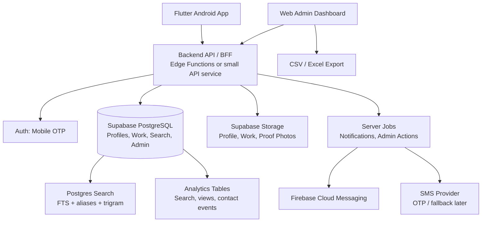

# Textile Marketplace MVP System Design

Date: 2026-07-01
Status: MVP architecture proposal
Source of truth: `outputs/textile-marketplace-requirements-discovery.md`

## 1. Executive Decision

Build the MVP as an Android-first, mobile-only marketplace for Surat private testing, with:

- Flutter + Dart Android app.
- A backend API layer between the app and database.
- Supabase-managed PostgreSQL for relational data, search, storage, auth infrastructure, and future portability.
- Firebase Cloud Messaging for Android push notifications.
- Basic web admin dashboard for manual verification, categories, user/profile management, and analytics.
- PostgreSQL category + keyword + alias search for the MVP.
- User-uploaded proof photos/documents, manually reviewed by admin.
- No payments, no subscription enforcement, no ratings, no customer support chat, no voice search, no offline drafts, no iOS in the MVP.

The MVP should prove three things:

1. Can users create useful textile profiles with photos and clear work categories?
2. Can users find the right work/service entries quickly?
3. Can admin verify and improve profile quality without slowing onboarding too much?

## 2. Research Notes And Implications

### 2.1 Aadhaar/KYC

Do not make Aadhaar mandatory in the MVP. Do not store raw Aadhaar numbers as normal application data.

Recommended MVP rule:

- Let users upload identity proof only for manual verification.
- Accept alternatives to Aadhaar where possible.
- If Aadhaar is uploaded, strongly prefer masked Aadhaar or a redacted image.
- Store verification status, reviewed-by admin, reviewed-at timestamp, and document type.
- Keep original proof documents in a private bucket with strict admin access.
- Add a retention policy before public launch.

Reasoning:

- Aadhaar and KYC are high-risk personal data areas.
- UIDAI supports masked Aadhaar and Aadhaar authentication has an official ecosystem.
- For a marketplace directory, the platform does not need to become an Aadhaar database.
- Later, integrate a regulated KYC provider and store provider response/token/status rather than raw identity data.

### 2.2 GST Verification

MVP should support manual GST verification:

- User enters GSTIN and optionally uploads proof/screenshot.
- Admin checks GST details manually and marks GST verified.
- Store GSTIN, legal/trade name, verification status, and reviewed timestamp.

Later:

- Integrate a GST/KYC verification provider if volume justifies it.
- Keep the integration behind a `verification_provider_checks` table so the provider can change without schema rewrite.

### 2.3 Privacy And Indian Data Protection

Before public launch, the app needs:

- Privacy policy.
- Terms of use.
- Consent for profile publishing and contact visibility.
- Consent for verification document upload.
- Data retention policy.
- Admin audit log.
- Data deletion/export workflow, even if the first version is manual.

The Digital Personal Data Protection Act creates obligations around consent, safeguards, breach handling, and user rights. Architecturally, minimize sensitive data and log admin access.

### 2.4 Hosting And Cost

For a 3-week MVP and solo founder, use managed services even if slightly more expensive than self-hosting.

Recommended path:

- Development: Supabase free tier can be used for schema and app development.
- Private demo with real users: move to Supabase Pro or equivalent managed Postgres plan with backups.
- Android push: Firebase Cloud Messaging.
- Admin dashboard: simple Next.js/React Admin app hosted on Vercel, Netlify, or Cloudflare Pages.

Avoid self-hosting PostgreSQL, object storage, auth, and backups in the MVP. The founder time cost is higher than the infrastructure savings.

### 2.5 Job/Work-Needed Post Lifecycle

The user does not want auto-expiry in MVP. Keep posts manually removable by the manufacturer.

Still design status fields from day one:

- `open`
- `closed_by_user`
- `removed_by_admin`
- `draft`

Later, add stale reminders such as "This need was posted 30 days ago. Still active?"

## 3. MVP Scope

### 3.1 In Scope

- Android app only.
- Mobile OTP, name, role selection.
- One user account has exactly one profile.
- Roles:
  - Textile Business: manufacturer, wholesaler, trader, retailer, process house, brand.
  - Value Adder / Job Worker: workshop, contractor, home-based team, processing unit.
  - Skilled Worker / Karigar.
- Profile creation and completion.
- Shop/workplace photos.
- Work photos.
- Persona B work/service sections.
- Persona A work-needed posts.
- Search by category, keyword, aliases/local terms, product type, role target, area/locality, verified status.
- Manual verification evidence upload.
- Admin dashboard for verification and basic operations.
- Basic analytics in admin.
- Push notifications for verification/status.
- Search query logs and profile/contact view logs.
- Admin-created seed profiles marked for testing.

### 3.2 Out Of Scope For MVP

- Payments/subscriptions.
- Contact reveal limits.
- Ratings/reviews.
- Support chat/call.
- Voice search.
- Offline draft saving.
- iOS.
- Provider-based Aadhaar/GST/KYC integration.
- AI category mapping.
- Full typo-tolerant multilingual search.
- Field agents.
- In-app order/job management.
- Wage/salary/pricing negotiation.
- Map directions.
- Videos.

## 4. Non-Functional Requirements

| Area | MVP Target |
|---|---|
| Users | 2,000 to 5,000 year-1 target |
| Launch | Private selected Surat users |
| Search latency | Under 1 second for common searches |
| Availability | Good enough for private demo, target 99%+ |
| Critical data | User profiles, profile media, verification status, search/contact logs |
| Backup | Daily automated backup before real user demo |
| Platform | Android first |
| Languages | English UI for internal/demo, translation structure prepared for Hindi/Gujarati |
| Data privacy | Minimize sensitive identity data, private proof storage, admin audit logs |
| Admin | Basic dashboard required |

## 5. High-Level Architecture

## 6. Component Design

### 6.1 Android App

Technology: Flutter + Dart.

Responsibilities:

- Mobile OTP login.
- Role selection.
- Guided profile setup.
- Work/service entry creation.
- Work-needed post creation for Persona A.
- Image capture/upload/compression.
- Search and filter UI.
- Profile detail UI.
- Save/favorite profiles.
- Verification document/photo upload.
- Push notification registration.

Why Flutter is acceptable:

- Android-first is easy.
- Future iOS does not require a rewrite.
- Good camera, image compression, file upload, localization, and FCM support.
- The app is form/search/media heavy, not a high-end native graphics app.

Risk:

- Some verification SDKs may have better native Android support than Flutter.

Mitigation:

- Keep verification behind a separate app module.
- Use platform channels later if a provider SDK requires native Android integration.

### 6.2 Backend Platform

Recommendation: use a backend-for-frontend API boundary. Supabase should be used as managed backend infrastructure, not as a direct public table API for the Flutter app.

MVP backend options:

1. **Fastest MVP**: Supabase Edge Functions act as the backend API layer.
2. **Cleaner long-term boundary**: small custom API service such as NestJS/Fastify/Express or FastAPI, connected to Supabase PostgreSQL.

Recommended final choice for this app: use a small custom API service if the founder wants the strict pattern "frontend -> backend -> database". Supabase remains the managed PostgreSQL, Storage, and Auth provider.

Important rule:

- Flutter app must not call `supabase.from(...)` or expose table-level business operations.
- Admin dashboard must not call tables directly from the browser.
- All business reads/writes go through backend endpoints.
- Backend uses secure server-side credentials or direct database connection.
- Supabase service role key never appears in Flutter or browser JavaScript.

Responsibilities:

- Auth and user identity.
- Relational profile data.
- Work/service entries.
- Work-needed posts.
- Search.
- Admin operations.
- Verification queues.
- File metadata.
- Event logs.
- Notification triggers.

Why not microservices:

- Solo founder.
- 3-week MVP.
- Year-1 target is 2k to 5k users.
- Domain is not yet stable enough to split services.
- Microservices would slow development and increase operational risk.

The design should still use clear module boundaries in database tables and API functions:

- Identity module.
- Profile module.
- Work catalog module.
- Search module.
- Verification module.
- Admin module.
- Media module.
- Notification module.
- Analytics module.
- Monetization placeholder module.

### 6.3 Admin Dashboard

Technology: Next.js or React Admin web dashboard using the same backend API boundary.

MVP admin features:

- Login as admin.
- User list.
- Profile list.
- Profile detail.
- Verification queue.
- Approve/reject/request changes.
- Category and alias management.
- Work-needed post moderation.
- Basic analytics:
  - total profiles
  - verified profiles
  - search terms
  - contact/profile views
  - top categories
- Admin-created test profile entry.
- CSV export.
- Admin audit log viewer.

Do not expose Supabase service role key in the browser. Admin reads/writes must go through server-side admin routes or protected backend endpoints.

## 7. Core Data Model

This is a logical schema, not final SQL.

### 7.1 Users And Profiles

`app_users`

- `id`
- `auth_user_id`
- `mobile_number`
- `display_name`
- `role`: `business`, `job_worker`, `skilled_worker`
- `status`: `active`, `suspended`, `deleted`
- `created_at`
- `updated_at`

`profiles`

- `id`
- `user_id`
- `role`
- `profile_name`
- `business_type`
- `bio`
- `years_experience`
- `area`
- `city`
- `state`
- `pincode`
- `manual_address`
- `contact_mobile`
- `whatsapp_number`
- `is_admin_seeded`
- `is_public`
- `verification_status`: `unverified`, `pending`, `verified`, `rejected`
- `profile_completeness_score`
- `created_at`
- `updated_at`

Rule: one `app_user` has exactly one `profile`.

### 7.2 Role-Specific Details

`business_profile_details`

- `profile_id`
- `manufactures_text`
- `sells_text`
- `manufacture_category_ids`
- `sell_category_ids`
- `gstin`
- `gst_status`
- `years_in_business`

`job_worker_profile_details`

- `profile_id`
- `workplace_type`
- `preferred_work_category_id`
- `gstin`
- `gst_status`
- `years_doing_work`

`skilled_worker_profile_details`

- `profile_id`
- `skill_summary`
- `experience_years`
- `preferred_work_category_id`

### 7.3 Categories And Aliases

`service_categories`

- `id`
- `parent_id`
- `name_en`
- `category_type`: `process`, `product`, `machine`, `material`, `finish`
- `is_active`
- `sort_order`

`service_category_aliases`

- `id`
- `category_id`
- `alias_text`
- `language`: `en`, `hi`, `gu`, `hinglish`, `local`
- `normalized_alias`

Initial category groups:

- Embroidery: zari, bead, aari, khatli, machine embroidery, hand embroidery.
- Decorative and hand work: mirror work, lace work, diamond work, zardhad diamond work, sarokhi diamond work.
- Printing: digital print, khadi print, wax print, table print, block print, ajrakh print, brush print.
- Dyeing and traditional processes: hand dyeing, murgha print, shibori, lahariya.
- Fabric finishing: crush pleating, washing, finishing, cutting, folding, packing.
- Stitching: flat hemming, overlock stitching, other stitching.

Important: category list must be admin-editable because the real Surat vocabulary will grow after field usage.

### 7.4 Work Entries

`profile_work_entries`

- `id`
- `profile_id`
- `title`
- `description`
- `primary_category_id`
- `product_category_ids`
- `machine_category_ids`
- `free_text_work_terms`
- `years_experience_for_work`
- `is_active`
- `admin_review_status`
- `search_text`
- `created_at`
- `updated_at`

Search result unit:

- Return matching `profile_work_entries`, not only whole profiles.
- Each search result shows work title, work photos, role/profile owner, locality, verification status, and profile completeness.

### 7.5 Work-Needed Posts

`work_needed_posts`

- `id`
- `profile_id`
- `title`
- `work_type_category_id`
- `product_category_id`
- `category_ids`
- `description`
- `area`
- `city`
- `status`: `draft`, `open`, `closed_by_user`, `removed_by_admin`
- `search_text`
- `created_at`
- `updated_at`

MVP:

- User manually closes/removes the post.
- No auto-expiry.

Later:

- Add stale reminders and auto-hide policy if needed.

### 7.6 Media

`media_assets`

- `id`
- `owner_profile_id`
- `linked_entity_type`: `profile`, `work_entry`, `work_needed_post`, `verification`
- `linked_entity_id`
- `bucket`
- `path`
- `media_type`: `shop_photo`, `work_photo`, `post_photo`, `identity_proof`, `gst_proof`
- `visibility`: `public`, `private_admin_only`
- `upload_status`
- `created_at`

Buckets:

- `public-profile-media`: profile, shop, and work photos.
- `private-verification-media`: ID proof, GST proof, sensitive verification media.

Mobile app compresses images before upload.

### 7.7 Verification

`verification_cases`

- `id`
- `profile_id`
- `case_type`: `mobile`, `identity`, `gst`, `shop`, `workplace`, `admin`
- `status`: `not_started`, `pending`, `approved`, `rejected`, `needs_changes`
- `submitted_at`
- `reviewed_by_admin_id`
- `reviewed_at`
- `notes_to_user`
- `internal_notes`

`verification_documents`

- `id`
- `verification_case_id`
- `document_type`: `masked_aadhaar`, `other_id`, `gst_proof`, `shop_photo`, `workplace_photo`
- `media_asset_id`
- `status`

Do not store Aadhaar number in plain structured fields. If future KYC provider is used, store provider result in a separate table:

`verification_provider_checks`

- `id`
- `profile_id`
- `provider_name`
- `provider_check_type`
- `provider_reference_id`
- `status`
- `raw_response_private_path`
- `created_at`

### 7.8 Search And Analytics

`search_logs`

- `id`
- `user_id`
- `query_text`
- `normalized_query`
- `target_role`
- `filters_json`
- `result_count`
- `clicked_result_id`
- `created_at`

`profile_view_events`

- `id`
- `viewer_user_id`
- `viewed_profile_id`
- `source`
- `created_at`

`contact_reveal_events`

- `id`
- `viewer_user_id`
- `viewed_profile_id`
- `event_type`: `profile_contact_visible`, `tap_call`, `tap_whatsapp`, `tap_address`
- `created_at`

MVP contact is fully visible, but record events for analytics where possible:

- Profile view.
- Tap call.
- Tap WhatsApp.
- Tap address.

Do not show analytics to profile owners in MVP.

### 7.9 Future Monetization Placeholder

Create minimal tables now, leave disabled:

`subscription_plans`

- `id`
- `name`
- `monthly_price`
- `yearly_price`
- `is_active`

`user_subscriptions`

- `id`
- `user_id`
- `plan_id`
- `status`
- `starts_at`
- `ends_at`

`contact_reveal_quotas`

- `id`
- `user_id`
- `free_reveals_total`
- `free_reveals_used`
- `period_start`
- `period_end`

Do not implement payment gateway in MVP.

## 8. Search Design

### 8.1 MVP Search Behavior

Inputs:

- Query text.
- Target persona to search:
  - find job workers
  - find businesses
  - find skilled workers / karigars
- Category filter.
- Product type.
- Locality/city.
- Verified-only.
- Experience.
- Photos present.

MVP matching:

1. Match direct service category.
2. Match alias/local term.
3. Match keyword in work entry title/description.
4. Match product category.
5. Match profile fields.

Use PostgreSQL:

- `tsvector` for full-text keyword search.
- `pg_trgm` for light fuzzy matching.
- category alias join for local terms.
- indexed normalized text fields.

For mixed Hindi/Gujarati/Hinglish:

- Store aliases explicitly.
- Do not rely on English stemming.
- Use a `normalized_alias` field.
- Improve later using search logs.

### 8.2 Ranking Formula

MVP weighted ranking:

1. Exact category match.
2. Alias/local-term match.
3. Verified profile.
4. Profile completeness score.
5. Work entry has photos.
6. Same city/locality.
7. Recently updated profile/work entry.

Paid promotion is not active in MVP.

Later paid ranking rule:

- Paid/promoted profiles should use sponsored slots or a capped boost.
- Do not let paid profiles destroy relevance, or users will stop trusting search.

## 9. API Surface

All mobile and admin business operations should go through the backend API. Do not use Supabase generated table APIs directly from the Flutter app for marketplace data.

Allowed direct client integrations:

- Firebase Cloud Messaging device registration at the OS/SDK layer.
- Optional Supabase Auth client only if auth is intentionally kept client-side.
- Optional signed upload URL flow where backend first authorizes upload, then the client uploads media to storage using a short-lived signed URL.

Strict mode:

- If the goal is zero Supabase access from the client, proxy auth and file uploads through the backend too.
- This is cleaner conceptually but adds more backend code.

### Auth

- `POST /auth/request-otp`
- `POST /auth/verify-otp`
- `POST /auth/logout`

### Profile

- `GET /me`
- `PATCH /me/profile`
- `POST /me/profile/photos`
- `GET /profiles/:id`
- `POST /profiles/:id/view-event`
- `POST /profiles/:id/contact-event`
- `POST /profiles/:id/favorite`
- `DELETE /profiles/:id/favorite`

### Work Entries

- `POST /me/work-entries`
- `PATCH /me/work-entries/:id`
- `POST /me/work-entries/:id/photos`
- `DELETE /me/work-entries/:id`

### Work-Needed Posts

- `POST /me/work-needed-posts`
- `PATCH /me/work-needed-posts/:id`
- `POST /me/work-needed-posts/:id/photos`
- `POST /me/work-needed-posts/:id/close`
- `GET /work-needed-posts`

### Search

- `GET /search/work-entries`
- `GET /search/profiles`
- `GET /categories`
- `GET /category-suggestions`

### Verification

- `POST /me/verification-cases`
- `POST /me/verification-cases/:id/documents`
- `GET /me/verification-status`

### Admin

- `GET /admin/users`
- `GET /admin/profiles`
- `GET /admin/verification-queue`
- `POST /admin/verification-cases/:id/approve`
- `POST /admin/verification-cases/:id/reject`
- `POST /admin/verification-cases/:id/request-changes`
- `CRUD /admin/categories`
- `CRUD /admin/category-aliases`
- `GET /admin/analytics/summary`
- `GET /admin/search-logs`
- `GET /admin/export/:dataset`

## 10. Security And Privacy Controls

### 10.1 MVP Controls

- OTP login.
- One account per mobile number.
- Role selected at registration and locked unless admin helps.
- Backend API is the only business data access path from mobile/admin.
- Supabase Row Level Security remains enabled as a defense-in-depth layer, not as the main application boundary.
- Admin-only access to verification proof.
- Private storage bucket for proof documents.
- Signed URLs for admin document review.
- Admin audit logs.
- Rate limiting on OTP, uploads, and search.
- Screenshot restriction on Android contact/proof screens where feasible.
- Terms/privacy/consent before public launch.

### 10.2 Strong Recommendation

Even though the MVP is free and private, require OTP login before showing exact contact/address.

Reason:

- Contact/address is personal and business-sensitive data.
- Private demo users are still real users.
- OTP login gives traceability for misuse.
- It does not block the "free launch" strategy.

If contact is shown without login, you cannot reliably know who copied whose data.

### 10.3 Aadhaar/KYC Rules

For MVP:

- Do not ask specifically for raw Aadhaar unless legal review/provider design is complete.
- Label upload as "Identity proof for verification".
- Accept alternate proof.
- If Aadhaar is uploaded, ask users to upload masked/redacted Aadhaar.
- Store only verification outcome in main profile.
- Keep uploaded documents private.

Later:

- Use a KYC provider.
- Store provider reference and result, not raw identity data.

## 11. Notifications

Use Firebase Cloud Messaging for Android push notifications.

MVP notification types:

- Verification submitted.
- Verification approved.
- Verification rejected.
- Admin requested changes.

Not MVP:

- Matching work-needed post alerts.
- Subscription expiry.
- Profile viewed.
- Promotional notifications.

Data model:

`device_tokens`

- `id`
- `user_id`
- `platform`: `android`
- `fcm_token`
- `last_seen_at`
- `is_active`

`notification_events`

- `id`
- `user_id`
- `type`
- `title`
- `body`
- `payload_json`
- `sent_at`
- `status`

## 12. Admin Workflow

### 12.1 Profile Verification Flow

1. User registers with mobile OTP, name, role.
2. User completes profile.
3. User uploads shop/work/proof photos.
4. User submits for verification.
5. Admin opens verification queue.
6. Admin reviews:
   - profile completeness
   - work photos
   - shop/workplace photos
   - identity proof if provided
   - GST proof if applicable
7. Admin approves, rejects, or requests changes.
8. User receives push notification.
9. Profile verification badge updates.

### 12.2 Blue Tick Rule For MVP

MVP blue tick means:

- Mobile verified.
- Profile is complete enough for its role.
- Required photos uploaded.
- Admin reviewed and approved.

For MVP, do not require real Aadhaar/GST API verification for blue tick.

Show detailed verification badges internally:

- Mobile verified.
- Profile reviewed.
- Shop/workplace photos reviewed.
- Identity proof reviewed.
- GST reviewed if applicable.

## 13. Data Access Rules

| Data | User Access | Admin Access |
|---|---|---|
| Public profile fields | Read public profiles | Full read |
| Contact/address in private demo | Visible after OTP login | Full read |
| Work photos | Public/readable in app | Full read |
| Verification documents | Owner can upload/status only | Admin review only |
| Search logs | Not visible to normal user | Admin analytics |
| Contact/profile events | Not visible in MVP | Admin analytics |
| Admin audit logs | No access | Super admin only |

## 14. Failure Modes

| Failure | Impact | MVP Mitigation |
|---|---|---|
| Database outage | App mostly unusable | Managed Postgres, backups, status monitoring |
| Storage upload fails | Profile incomplete | Retry upload, show draft state |
| Search slow | Core product feels broken | Proper indexes, limit result size, log slow queries |
| SMS/OTP issue | Users cannot log in | Use reliable SMS provider, admin test numbers |
| FCM issue | Verification status push delayed | Show status inside app on refresh |
| Admin mis-approval | Trust damage | Audit logs and verification notes |
| Sensitive document exposure | Serious privacy risk | Private bucket, signed URLs, no public proof links |
| Bad category taxonomy | Poor search | Admin-editable categories and aliases |

## 15. Scaling Path Without Rewriting

MVP: 2k to 5k users

- Supabase Postgres.
- Postgres search.
- Supabase Storage.
- Basic admin dashboard.
- FCM notifications.

Next: 50k to 100k users

- Move to paid managed Postgres plan.
- Add read replicas if needed.
- Add CDN/image transformations.
- Add background jobs for image processing.
- Improve search with logs, aliases, synonyms, and trigram.
- Add Redis only if rate limits/cache become necessary.

Later: 1M+ users

- Add OpenSearch/Meilisearch as a rebuildable search projection.
- Add queue/event system for notifications and media processing.
- Split admin-heavy analytics into separate warehouse.
- Add dedicated API backend if Supabase Edge Functions become limiting.

Long-term: 50M+

- Multi-region strategy.
- Sharded/read-optimized search.
- Dedicated identity/trust service.
- Dedicated marketplace ranking service.
- Data warehouse and experimentation platform.

Do not design MVP as if 50M users arrive next month.

## 16. Three-Week MVP Build Plan

### Week 1: Foundation

- Supabase project.
- PostgreSQL schema.
- Storage buckets.
- Auth/OTP setup.
- Flutter project.
- Role selection.
- Basic profile create/edit.
- Admin dashboard skeleton.

### Week 2: Marketplace Core

- Work/service entries.
- Work photos.
- Work-needed posts.
- Category and alias tables.
- Search endpoint/query.
- Profile detail.
- Favorites.
- Admin category management.
- Admin verification queue.

### Week 3: Trust, Admin, Demo Readiness

- Verification upload flow.
- Admin approve/reject/request changes.
- Push notifications for verification status.
- Analytics tables and admin summary.
- Admin-created seed profiles.
- CSV export.
- Privacy/terms draft.
- Backup setup.
- Private demo test with selected Surat users.

Scope cuts if timeline slips:

1. Favorites.
2. CSV export.
3. Advanced analytics.
4. Work-needed post photos.
5. Profile completeness UI polish.

Do not cut:

1. Profile creation.
2. Work entries.
3. Work photos.
4. Search.
5. Admin verification.
6. Basic backup.

## 17. ADRs

### ADR-001: Use Modular Monolith / Managed Backend For MVP

Status: Accepted for MVP

Context:

- Solo founder.
- 3-week MVP.
- 2k to 5k year-1 users.
- Product domain is still being discovered.

Decision:

Use one backend API boundary with clear module boundaries, not microservices. Supabase is used as managed infrastructure behind the backend API.

Alternatives considered:

- Microservices: rejected due to operational complexity.
- Fully custom backend from day one: slower than needed.
- Firebase-only backend: faster but weaker for relational taxonomy/search.

Consequences:

- Faster build.
- Easier debugging.
- Clear path to split services later only when real bottlenecks exist.
- The Flutter app does not depend on Supabase table APIs, so the database/provider can be changed later with less frontend rewrite.

### ADR-002: Use PostgreSQL As Source Of Truth

Status: Accepted for MVP

Context:

- Profiles, roles, categories, aliases, work entries, verification cases, analytics, and subscriptions are relational.
- Search is core, but MVP search can start inside Postgres.

Decision:

Use PostgreSQL as the source of truth.

Alternatives considered:

- Firestore: fast MVP but awkward for relational search and admin analytics.
- MongoDB: flexible but unnecessary and weaker for relational integrity.
- OpenSearch as primary store: wrong source-of-truth model.

Consequences:

- Strong relational model.
- Good admin queries.
- Can add OpenSearch later as rebuildable projection.

### ADR-003: Start Search In PostgreSQL

Status: Accepted for MVP

Context:

- MVP search needs category, keyword, aliases, and local terms.
- Typo-tolerant multilingual search is later.

Decision:

Start with PostgreSQL FTS, trigram, normalized text, and explicit alias tables.

Alternatives considered:

- OpenSearch from day one: too much setup for 3-week MVP.
- Algolia: fast but vendor cost/lock-in and still needs relational source.
- Exact SQL only: too weak for textile aliases/local terms.

Consequences:

- Lower operational load.
- Search logs can guide future improvement.
- Later migration to OpenSearch is straightforward.

### ADR-004: Manual Verification Before Provider KYC

Status: Accepted for MVP

Context:

- Aadhaar/GST/KYC require legal/provider research.
- MVP is private selected-user demo.
- Founder wants admin manual review.

Decision:

Use manual proof upload and admin status first.

Alternatives considered:

- Aadhaar/GST provider integration from day one: higher compliance and implementation risk.
- No verification: weak trust signal.

Consequences:

- Faster MVP.
- Verification quality depends on admin process.
- Future provider integration remains clean through `verification_provider_checks`.

### ADR-005: Flutter Android First

Status: Accepted for MVP

Context:

- Android-only MVP.
- Founder prefers Flutter/Dart.
- Future iOS may be needed.

Decision:

Build MVP mobile app in Flutter.

Alternatives considered:

- Native Android Kotlin: best native SDK access, slower future iOS.
- React Native: viable, but no stronger fit than Flutter here.
- Web/PWA: not ideal for camera, low-literacy mobile UX, and app-market trust.

Consequences:

- Fast Android MVP.
- Future iOS reuse.
- Native SDK edge cases handled through platform channels if needed.

### ADR-006: Basic Admin Dashboard First

Status: Accepted for MVP

Context:

- Founder wants full admin control eventually.
- 3-week MVP cannot include every admin capability.

Decision:

Build basic web admin dashboard with profile approval, verification, categories, analytics, users, and CSV export.

Alternatives considered:

- No admin: impossible because verification is manual.
- Full admin platform: too much for MVP.

Consequences:

- Admin can operate private demo.
- Later add subscriptions, reports, support, field agents, moderation automation.

### ADR-007: Minimize Aadhaar/Identity Data

Status: Accepted for MVP

Context:

- Identity proof is sensitive.
- The app only needs trust status, not an Aadhaar database.

Decision:

Store verification status and private proof media, avoid structured raw Aadhaar storage, and prefer masked/redacted proof.

Alternatives considered:

- Store raw Aadhaar numbers/documents as normal fields: rejected due to privacy and compliance risk.
- Avoid identity proof completely: weaker blue tick trust.

Consequences:

- Lower privacy risk.
- Admin process needs careful access control.
- Provider-based KYC can replace manual review later.

## 18. Final MVP Recommendation

Build exactly this first:

1. Flutter Android app.
2. Backend API layer between app/admin and database.
3. Supabase Postgres, Auth, Storage as managed infrastructure.
4. FCM push notifications.
5. Basic web admin dashboard.
6. Role-based profiles for A, B, C.
7. Work entries as the primary searchable object.
8. Work-needed posts for manufacturers.
9. Category + keyword + alias search.
10. Manual verification queue.
11. Search/profile/contact event logging.

Do not build payments, ratings, chat, voice, provider KYC, iOS, or full AI search in the first three weeks.

## 19. Source Links

- UIDAI masked Aadhaar FAQ: https://www.uidai.gov.in/en/283-faqs/aadhaar-online-services/e-aadhaar/1887-what-is-masked-aadhaar.html
- UIDAI authentication ecosystem: https://uidai.gov.in/en/ecosystem/authentication-ecosystem.html
- Digital Personal Data Protection Act, 2023, MeitY: https://www.meity.gov.in/data-protection-framework
- GST taxpayer search user guide: https://tutorial.gst.gov.in/userguide/taxpayersdashboard/Search_Taxpayer_manual.htm
- Supabase pricing: https://supabase.com/pricing
- Supabase phone login docs: https://supabase.com/docs/guides/auth/phone-login
- Supabase custom SMS hook docs: https://supabase.com/docs/guides/auth/auth-hooks/send-sms-hook
- Supabase Postgres full-text search docs: https://supabase.com/docs/guides/database/full-text-search
- Supabase Storage docs: https://supabase.com/docs/guides/storage
- Firebase Cloud Messaging: https://firebase.google.com/products/cloud-messaging
- Android FLAG_SECURE reference: https://developer.android.com/reference/android/view/WindowManager.LayoutParams#FLAG_SECURE
